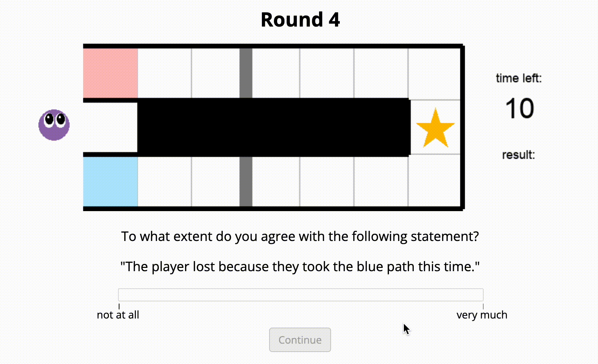
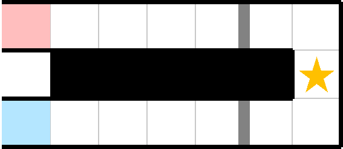

# That was close! A counterfactual simulation model of causal judgments about decisions

This repository contains the models, experiments, data, analyses, and figures
for the paper "That was close! A counterfactual simulation model of causal
judgments about decisions" by Sarah A. Wu, Shruti Sridhar, and Tobias Gerstenberg.

To be presented at the 44th Annual Conference of the Cognitive Science Society
(CogSci 2022), and published in the Conference Proceedings.

__Contents__:
- [Introduction](#introduction)
- [Repository structure](#repository-structure)
- [Usage](#usage)


## Introduction

How do people make causal judgments about other people's decisions?
Prior work in psychology has argued that causal judgments are closely linked
to counterfactual simulations. Accordingly, judging causation requires going
beyond what actually happened and simulating what would have happened if
things had played out differently. In the physical domain, recent work has
shown how such a counterfactual simulation model accurately captures people's
judgments about dynamic physical events. Here, we extend this model to
explain people's causal judgments about other agents' decisions. We develop
a novel experimental paradigm in which an agent needs to choose what path
to take in order to reach a goal. The paths feature doors that can open and
close over time. In Experiment 1, one group of participants made hypothetical
judgments about whether the agent would succeed were it to take a certain path,
and another group made counterfactual judgments about whether the agent would
have succeeded had it taken a different path. In Experiment 2, participants
made causal judgments about whether the agent succeeded or failed because of
the path that it took. Our computational model accurately captures
participants' judgments in both experiments and, in line with what has been
shown in the physical domain, we find that causal judgments are better
explained by counterfactual rather than hypothetical simulations.




## Repository structure 

```
├── code
│   ├── R
│   ├── experiments
│   └── python
├── data
├── docs
└── figures
```

- `code/`
    - `R/` contains all the code for analyzing data and generating figures
      (see a rendered file [here](https://cicl-stanford.github.io/counterfactual_decisions/)).
    - `experiments/` contains model predictions and info about the experiment trials.
    - `python/` contains all the code for our environment and simulation
      models (see usage details below).
- `data/` contains anonymized data from both experiments. For each experiment,
  `participants.csv` contains demographic information and post-experiment
  feedback/comments from participants, and `trials.csv` contains the actual
  judgment data.
- `docs/` contains all the experiment code. You can preview the experiments below:
    - [Experiment 1 - counterfactual](https://cicl-stanford.github.io/counterfactual_decisions/experiment1_cf/)
    - [Experiment 1 - hypothetical](https://cicl-stanford.github.io/counterfactual_decisions/experiment1_hyp/)
    - [Experiment 2](https://cicl-stanford.github.io/counterfactual_decisions/experiment2/)
- `figures/` contains the two figures from the paper (generated using the script
  in `code/R/`) as well as gifs and still images of all the experiment trials.


## Usage

### Running models

Make sure you're in the `code/python/experiment/` directory and can see `main.py`.
This is the primary file for generating trials and running the simulation models.
The basic command structure for running the models on a specific trial is:

```
python main.py --generate-trials --trial <trial> --cf --hyp
```

where `<trial>` is the trial number from `1` to `18`. This flag can be left off to run all 18 trials.
`--cf` and `--hyp` indicate running the counterfactual and hypothetical simulation models, respectively.
Both, neither, or just one of these flags can be included.
For example, the command to run only the counterfactual model on all 18 trials is:

```
python main.py --generate-trials --cf
```

Other flags that can be added:
- `--visualize` will generate step-by-step images and a gif of the specified trial (or
  all trials), which will be saved in `trials/` under the corresponding trial number.
  However, don't visualize and run any models in the same command or pygame will break.
- `--verbose` (while running a model) will print out step-by-step information
  about each simulation as it's running, which can be useful for debugging.
- `--save-trial-data` will record the outcomes and simulation results in
  `code/experiment/experiment.csv`. Note that this will override the current file.
- `--n-simulations <n>` specifies the number of simulations to run, default 1000.
- `--prob-stall <p>` specifies the probability that the agent stalls on any
  time step, default 0.12 (fitted to data).
- `--prob-door <p>` specifies the probability of a door switching on any time
  step, default 0.19 (fitted to data).
- `--time-limit <t>` specifies the maximum number of time steps in each trial, default 10.


### Modifying or creating new trials

The command `--make-image` can be used to generate and save an image of the gridworld
for a specific trial, in the `grid_images/` directory:

```
python main.py --make-image --trial <trial>
```

This can be helpful especially if you want to modify any of the current grids
or create a new one and see what it looks like.
All the gridworlds are located in `grids/` as text files. Each file has two parts separated by an empty line:

1. The initial states of each door as `0` (closed) or `1` (open) with each door on its own line.
2. The grid, which gets parsed into gridworld objects:
    - `r` and `b` --> red and blue start squares
    - `g` --> goal square
    - <code>&nbsp;</code> --> floor square
    - `.` --> placeholder divider between two floor squares
    - `|` --> vertical door between two floor squares
    - `X` --> inaccessible square

For example, the code below on the left implements the grid on the right with two initially closed doors.
<div align="center">
<table>
<tr>
<td style="width:50%">

```
0
0

r. . . . | .
 .X.X.X.X.X.g
b. . . . | .
```

</td>
<td>

</img>

</td>
</tr>
</table>
</div>

Door state changes are defined in `code/experiment/experiment.json`. Each JSON string contains:
- `"num"`: the trial number (`1` to `18`)
- `"path"`: the path chosen (`"red"` or `"blue"`)
- `"door_changes"`: list of door state changes expressed as another JSON string
  with time steps as properties and a list of locations of doors that will
  switch states on that time step as values. Doors are marked by the square
  immediately to their left with the origin at the top left. For example,
  the two doors in the grid above are located at (5, 0) and (5, 2) and
  `{"2": [[5, 0], [5, 2]]}` means that both would open on the second time step.

Feel to make your own grids and trials, and test the simulation models on them!
